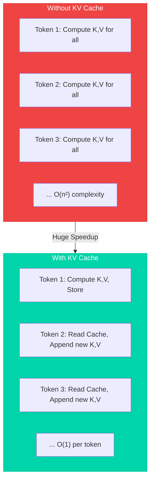
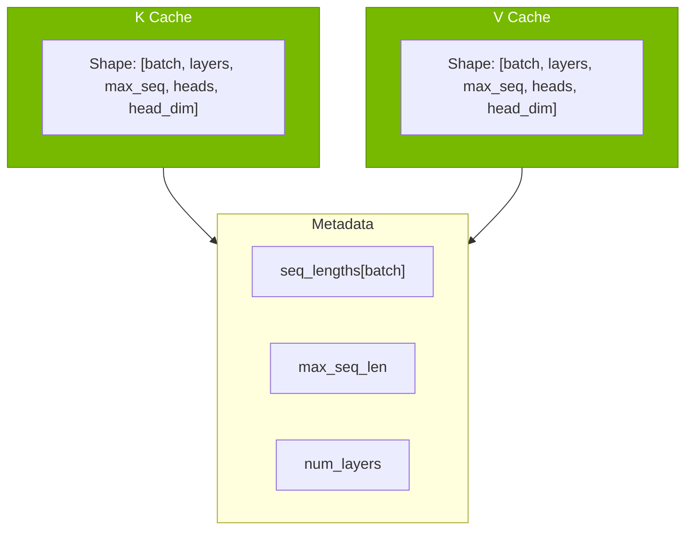
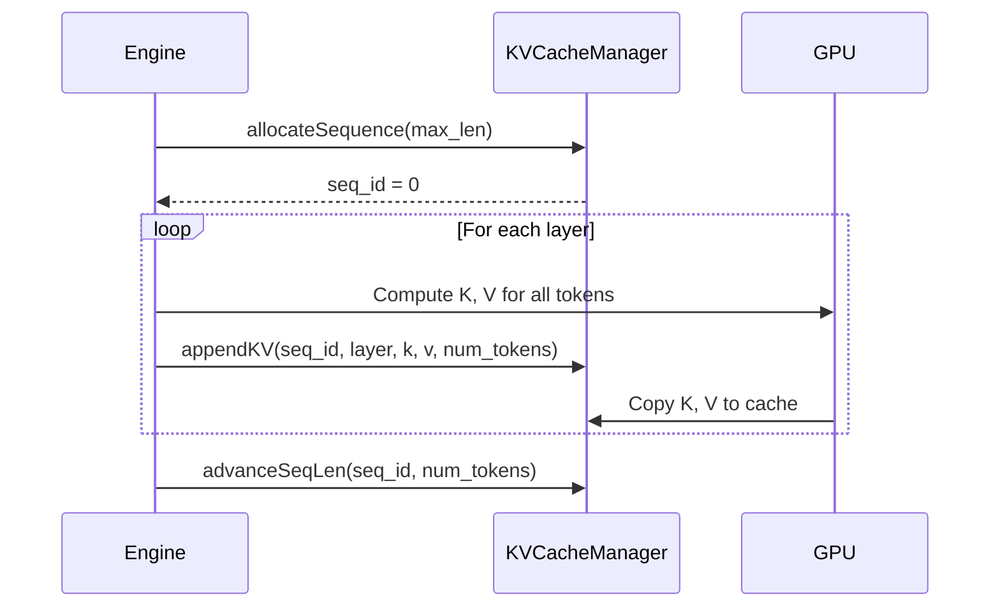
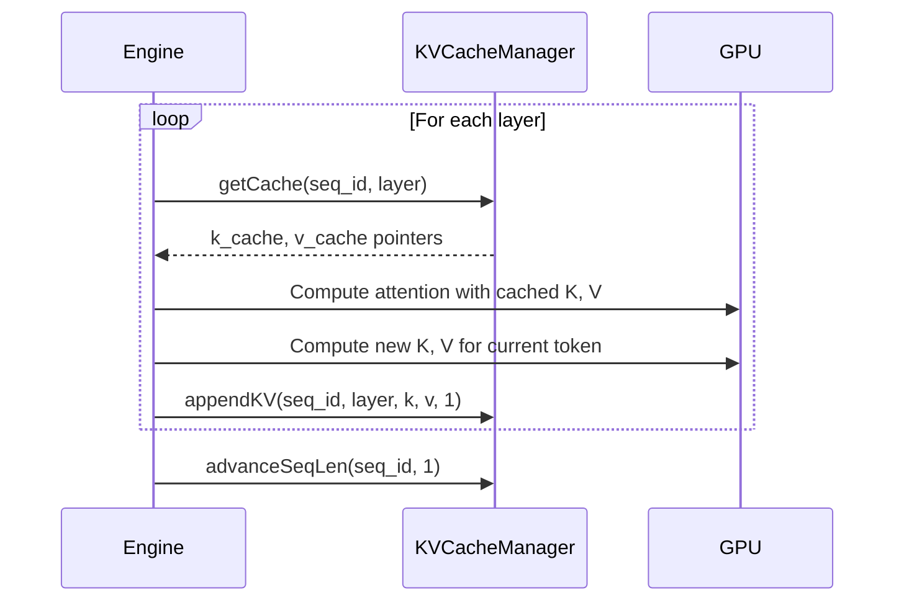
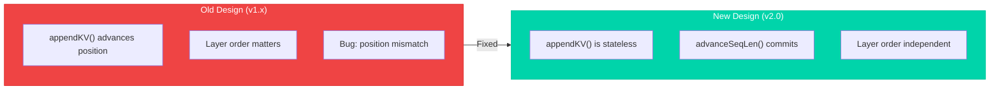
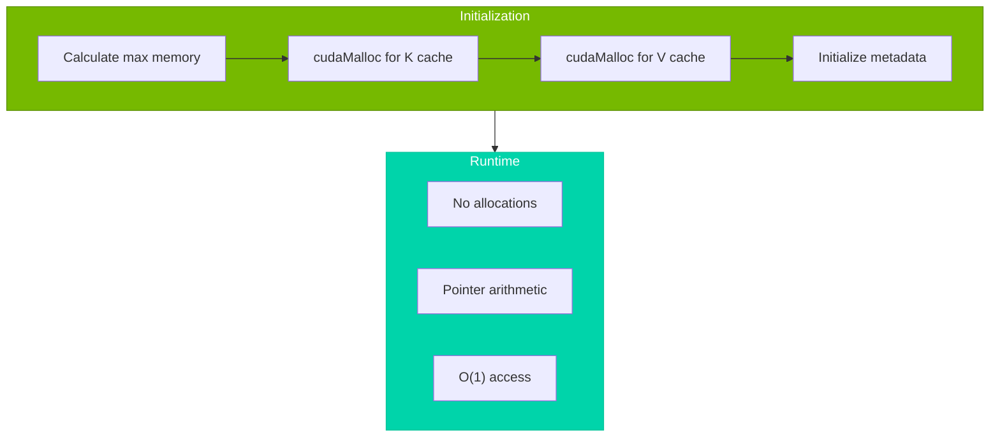
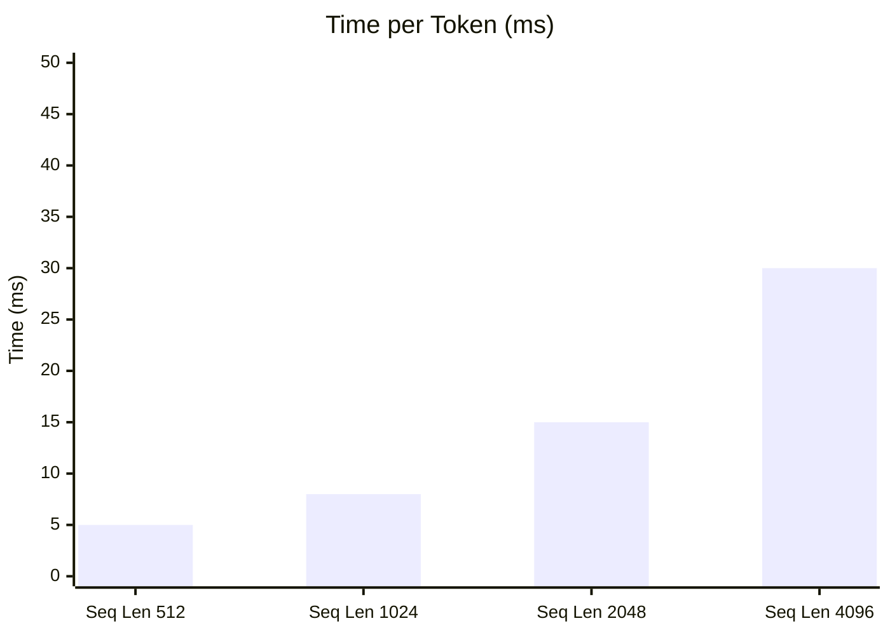
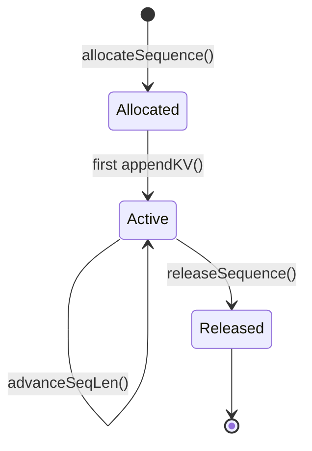

# KV Cache Management

Efficient key-value cache for autoregressive generation.

## Overview

The KV Cache stores key and value tensors from previous attention computations, enabling O(1) incremental decoding instead of O(n²) full recomputation.



---

## Memory Layout

### Cache Structure



### Memory Calculation

For a 7B model with batch_size=1, max_seq_len=4096:

```
K Cache: 1 × 32 × 4096 × 32 × 128 × 2 bytes = 1 GB
V Cache: 1 × 32 × 4096 × 32 × 128 × 2 bytes = 1 GB
Total: 2 GB
```

---

## API Reference

### KVCacheManager Class

```cpp
class KVCacheManager {
public:
    // Constructor: pre-allocate cache slots
    KVCacheManager(
        int max_batch_size,
        int num_layers,
        int max_seq_len,
        int num_kv_heads,
        int head_dim,
        cudaStream_t stream = 0
    );

    // Allocate a new sequence slot
    Result\<int\> allocateSequence(int max_len);

    // Release a sequence slot
    void releaseSequence(int seq_id);

    // Append KV for a specific layer (stateless)
    void appendKV(
        int seq_id,
        int layer_idx,
        const half* k,           // [num_tokens, heads, head_dim]
        const half* v,
        int num_tokens,
        cudaStream_t stream = 0
    );

    // Advance sequence length after all layers
    void advanceSeqLen(int seq_id, int num_tokens);

    // Access cached K/V for attention computation
    std::pair<half*, half*> getCache(int seq_id, int layer_idx);

    // Get current sequence length
    int getSeqLen(int seq_id) const;
};
```

---

## Usage Patterns

### Prefill Phase



### Decode Phase



---

## Design Evolution

### v2.0 Redesign

The v2.0 redesign fixed a critical issue where layer order affected write positions.



### Stateless appendKV

```cpp
// v2.0: appendKV doesn't advance position
cache.appendKV(seq_id, layer_idx, k, v, num_tokens);
// Position is determined by current seq_len, not by write count

// Explicit commit after all layers
cache.advanceSeqLen(seq_id, num_tokens);
```

---

## Paged KV Cache (Strategy 1)

The contiguous `KVCacheManager` above serves single-engine generation. The
**paged KV path** (strategy 1) serves the serving control plane
(`paged-serving`) through the C ABI: instead of reserving `max_seq_len` per
sequence, KV is stored in a shared pool of fixed-size blocks referenced by
per-sequence block tables, so memory is allocated only for visible tokens.

### Pool layout

```
k_pool / v_pool: [num_layers * max_num_blocks * block_size * kv_dim] half
block_table:     device int[visible_blocks]  (physical block ids)
k_scratch / v_scratch: [max_visible_tokens * kv_dim]  (gather target)
```

The pool is indexed as `pool[(layer * max_num_blocks + block_id) * block_size + within] * kv_dim`
for the K/V of one head group; callers pass the layer-offset base pointer.

### PagedKVCacheView

`PagedKVCacheView` (see `include/tiny_llm/transformer.h`) bundles the per-step
state: pool pointers, the flat block table, scratch buffers, `block_size`,
`max_num_blocks`, the absolute `position` of the step's first token, and an
optional device `decode_len` (decode-only; `nullptr` for prefill).

### Scatter / gather kernels

- `paged_scatter_blocks` writes the step's K/V from contiguous
  `[num_tokens, kv_dim]` buffers into the pool via the block table.
- `paged_gather_blocks` reads the visible range `[visible_tokens, kv_dim]`
  back into scratch for the attention kernel.
- Both take `max_num_blocks` and **guard the block-id range**: ids outside
  `[0, max_num_blocks)` are skipped on scatter and written as 0 on gather,
  so a corrupt block table can no longer cause illegal-address faults that
  poison the whole CUDA context.

### Decode attention dispatch (paged path)

The paged decode step supports two addressing strategies behind the
`TLLM_PAGED_ATTENTION` environment switch (`auto | legacy | direct`,
case-insensitive; unparsable values fail loudly):

- `legacy` (default): gather the visible window to contiguous scratch via
  `paged_gather_blocks`, then run `attention_decode`.
- `direct` / `auto` (equivalent today): `attention_decode_paged` reads K/V
  directly from the pool through the block table and skips both gathers.
  Visible length travels as a device `int`, so the launch path stays
  CUDA-Graph-capturable.

`direct` is **bitwise-identical** to `legacy` at kernel, layer, and C-ABI
levels (`tests/test_paged_direct.cpp`, `tests/test_paged_dispatch.cpp`,
`tests/test_ffi_paged_dispatch.cpp`). Performance is context-dependent:
the archived three-way kernel benchmark
([2026-09-14-rtx5070ti-dpa](../performance/results/2026-09-14-rtx5070ti-dpa.md))
showed `direct` faster only at `visible_tokens <= 128` and slower at long
windows (up to ~15% at S=2048), so the default remains `legacy` — the
§10/§11 default flip was explicitly not triggered.

An optional split-KV decode (`TLLM_ATTN_SPLITKV = 2..32`, default off)
partitions the visible window across blocks and combines partials; it applies
to both `legacy` (post-gather) and `direct` addressing. The archived sweep
([2026-09-15-rtx5070ti-splitkv](../performance/results/2026-09-15-rtx5070ti-splitkv.md))
measured `direct_splitkv@16` ~6x faster than single-pass `direct` at
`visible=2048` but up to ~1.9x slower at `visible <= 129` (fixed combine
overhead), and there is no host-side adaptive trigger, so it stays opt-in.

All numbers above are **kernel-level** evidence only; no serving-level
TTFT/TPOT claim is made. The FFI-level equivalence gate
(`tests/test_ffi_paged_dispatch.cpp`) covers `legacy`/`direct`/`auto`/
split-KV through `tinyllm_step` on a synthetic GGUF.

### C ABI integration

The paged pool is allocated inside `ffi.cpp` (`paged_k_pool` / `paged_v_pool`
via `cudaMalloc`). `forwardPaged` dispatches on `max_num_blocks`: strategy 1
(>0, block tables honored) vs strategy 2 (== 0, contiguous KV). The contract
is dual-sourced with `paged-serving/src/tiny_llm_ffi.rs` (repr(C) layout guard
tests) and differentially tested in `tests/test_ffi.cpp` (strategy 1 vs 2,
token-by-token) and `paged-serving/tests/tiny_llm_backend.rs`.

---

## Memory Management

### Pre-allocation Strategy



### Memory Pool

```cpp
// Pre-allocate at initialization
size_t cache_size = max_batch_size * num_layers * max_seq_len 
                  * num_kv_heads * head_dim * sizeof(half);

half* k_cache_pool;
half* v_cache_pool;
cudaMalloc(&k_cache_pool, cache_size);
cudaMalloc(&v_cache_pool, cache_size);

// O(1) access during inference
half* get_k_cache(int seq_id, int layer, int pos) {
    return k_cache_pool + 
           (seq_id * num_layers + layer) * max_seq_len * heads * dim +
           pos * heads * dim;
}
```

---

## Performance Considerations

### Memory Bandwidth

KV Cache access is memory-bandwidth bound. Optimizations:

| Technique | Implementation | Benefit |
|-----------|----------------|---------|
| Coalesced Access | Contiguous memory layout | Maximum bandwidth |
| Pointer Caching | Cache pointers per layer | Reduced arithmetic |
| Async Copy | cudaMemcpyAsync | Overlap with compute |

### Cache vs Recompute Trade-off



---

## Multi-Sequence Support

### Batch Processing

```cpp
// Allocate multiple sequences
int seq1 = cache.allocateSequence(2048);
int seq2 = cache.allocateSequence(2048);
int seq3 = cache.allocateSequence(4096);

// Independent generation
engine.generate(prompt1, config, seq1);
engine.generate(prompt2, config, seq2);
engine.generate(prompt3, config, seq3);

// Release when done
cache.releaseSequence(seq1);
```

### Sequence States



---

## References

- [Efficient Inference for Large Language Models](https://arxiv.org/abs/2302.01718) - Kwon et al., MLSys 2023 (vLLM PagedAttention)
- [FlashAttention](https://arxiv.org/abs/2205.14135) - Dao et al., NeurIPS 2022
